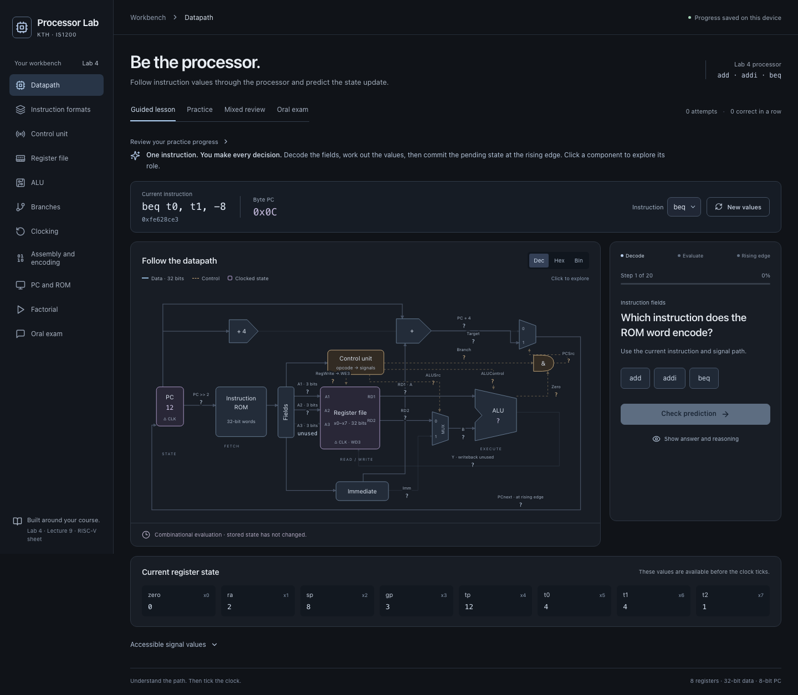

# Processor Lab · IS1200

An interactive study workbench for KTH IS1200 Lab 4 – Processor Design. Decode instructions, derive control signals, trace the datapath, and apply the rising clock edge yourself. Static React + TypeScript + Vite; no backend, keys, account, or external runtime services.

**[Open the learning app](https://liltaket.github.io/is1200-processor-lab/)** · [Source repository](https://github.com/liltaket/is1200-processor-lab)



## Learning modes

- **Manual datapath:** work through a complete `add`, `addi`, or `beq` cycle. Unknown signals become visible as you solve them; stored state changes only when you apply the clock edge. Click or keyboard-activate components to explore their roles.
- **Instruction formats and assembly encoding:** place R/I/B fields, then build an instruction through format, opcode, operands, field placement, and hexadecimal word stages. Guided field hints are unscored.
- **Control, register file, and ALU:** derive generated controls, experiment with immediate reads and pending writes, and predict 32-bit arithmetic/logic results. Subtraction shows conditional XOR inversion and carry-in.
- **Branches, clocking, and PC/ROM:** distinguish Branch from Branch AND Zero, derive both PC paths, classify timing events, and convert byte PC addresses to word indices.
- **Factorial/program trace:** edit assembly or import assembly/hex words, step or run a bounded program, and predict register results across instruction edges.
- **Oral preparation:** explain 32 source-linked prompts in your own words and self-assess against expected concepts. Lab 4 and Lecture 9 scopes are separate.

Practice accuracy is saved locally. Mixed review selects less-practiced or lower-accuracy subjects; answers revealed or retried after feedback do not earn additional correct attempts. Mobile diagrams and instruction strips scroll within their panels.

## Local development

Use Node.js 24 or newer.

```sh
npm ci
npm run dev
```

```sh
npm test
npm run typecheck
npm run lint
npm run build
npm run preview
npm run test:e2e
```

Browser tests require Playwright Chromium (`npx playwright install chromium`). Progress stays in this browser's localStorage; blocked storage never prevents practicing. Session streaks reset on reload.

The browser suite starts its own production preview on strict port 4180 and refuses to reuse another project's server. For a deliberately chosen running server, set `TEST_BASE_URL`.

## Processor scope

**Lab 4:** `add`, `addi`, `beq`, x0–x7 (`zero`, `ra`, `sp`, `gp`, `tp`, `t0`, `t1`, `t2`). The lab's byte-addressed PC is **8 bits** and wraps at 256. ROM indexing uses `PC >> 2`. Standard machine words contain **5-bit** register fields; the physical register file uses their low **3 bits**. Program entry enforces the lab's register subset. Register reads are combinational; writes and PC updates occur at the rising edge. x0 is immutable.

The ALU component also supports AND, OR, and signed SLT. Its Zero signal is required for ADD/SUB by the Lab 4 contract; the simulator calculates Zero for all operations as a deterministic convention, and explains that the lab does not consume it for logical operations.

**Lecture 9 extension:** canonical encoding/execution additionally supports `lw`, `sw`, `and`, `or`, `slt`, explicit immediate format selection and data memory, while retaining the teaching model's eight physical registers. Extension material is labelled separately; it is not an assertion that the Lab 4 circuit supports those instructions. Unsupported encodings throw readable errors.

Full B-type immediates are reconstructed from scattered fields with sign extension and implicit low bit zero. Encodings permit two-byte offsets; taken branches in this processor must fetch a four-byte-aligned instruction.

## Sources

The primary pedagogical sources are the supplied 2026 `lab4-processor-design.pdf` and `lecture9.pdf`. Exact fields/encodings use `riscv-instruction-sheet_improved.pdf` (version 1.2, December 12, 2025). The requested `lab4-processor-design(1).pdf` name was unavailable; the supplied Downloads file above was inspected instead. Course PDFs are not redistributed in this repository.

Source hashes (SHA-256):

- Lab 4: dc80edf23b3a90f58a664cb5844934b6567fb10598beca430b9fe00f43f90d8a
- Lecture 9: abfb2f991c5afd98abd3d1c179367013db13149879aeab2d778f3b2131849501
- Reference sheet: 9a426db590c43296510c248bb4a9553ab7ebfc04dda6a8a7ed40103557d8edb0

See [source analysis](docs/SOURCE_ANALYSIS.md), [learning plan](docs/LEARNING_PLAN.md), and [actual engine API](docs/ENGINE_API.md). Source page references appear in oral practice. No factorial implementation or `test.S` listing was supplied: the editable factorial demonstration is explicitly authored, uses repeated addition, and is tested for 0!, 3!, and 8!. Import or enter your own program to study your circuit's solution.

## Architecture

`src/engine/` is the single processor model: instruction definitions, encoding/decoding, control, ALU, register file, PC, assembly, pure cycle evaluation, and rising-edge commits. Learning modules and program traces consume it instead of duplicating execution semantics. `src/learning.ts` owns oral content, timing questions, and guarded local progress. UI modes share a dark workbench design system.

## Validation

The local acceptance run passed 38 unit tests, 23 Chromium browser tests, strict TypeScript checking, ESLint, and the production build. Browser coverage includes a complete manual cycle, x0, signed overflow, B immediate fragments, correct and incorrect field placement, program import, factorial 0/3/8, saved and blocked storage, and keyboard navigation. All 11 views were checked for document overflow at 390 px and 1024 px. Desktop, tablet, and mobile screenshots received an independent visual review; the three findings were corrected.

A separate production build with `/subpath-check/` was served by a plain static HTTP server. All 11 hash destinations loaded and survived refresh with assets inside the subpath. This validates static routing locally. The deployment workflow validates the published revision on GitHub before releasing the Pages artifact. See [correctness review](docs/CORRECTNESS_REVIEW.md), [UX review](docs/UX_REVIEW.md), and [design system](DESIGN.md).

## GitHub Pages deployment

`.github/workflows/pages.yml` automatically deploys **every push to `main`**, including merge commits from PRs. Pull requests targeting `main` run checks without publishing. Tests, TypeScript, ESLint, the production build, and Chromium browser tests must all pass before deployment. You can also run the workflow manually from Actions on `main`. Action revisions are pinned; the repository Pages source is **GitHub Actions**.

The workflow obtains the Pages base path from `configure-pages`. Locally, relative asset paths are used; override them for a subpath build:

```sh
VITE_BASE_PATH=/is1200-processor-lab/ npm run build
```

Navigation uses URL hashes, so deep navigation and refresh work on a static Pages server without rewrite rules. The workflow follows the official [Vite Pages guide](https://vite.dev/guide/static-deploy.html) and [GitHub custom Pages workflow documentation](https://docs.github.com/en/pages/getting-started-with-github-pages/using-custom-workflows-with-github-pages).

The deployment target is `liltaket/is1200-processor-lab`. Check [the workflow runs](https://github.com/liltaket/is1200-processor-lab/actions/workflows/pages.yml) for the result of each published revision. Failed validation prevents deployment, preserving the last successfully deployed site.
